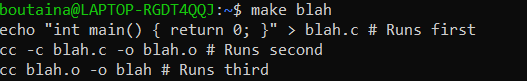
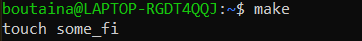
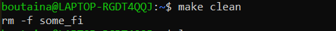

# Automatiser-la-production-de-code
 1.Running Makefile
 
  

 2.Makefile targets
 
   
   
 3.Makefile targets
 
   
   
 4.make clean
 
   
 
 5.The all targets
 
   
   
   
 
 2.Makefile targets
 
   
   
 2.Makefile targets
 
   
   
 2.Makefile targets
 
   
  
          
         
