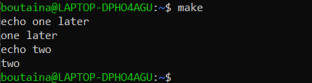

# Automatiser-la-production-de-code

 1.Running Makefile
 
  

 2.Makefile targets
 
   
   
 3.Makefile targets
 
   
   
 4.make clean
 
   
 
 5.Variables
 
   
   
 
 6.The all targets
 
   
   
   
   
 7.Multiple targets
  
   
   
   
   
 8.Multiple targets
  
   
   
   
 
 9.Automatic Variables
 
   
   
   
   
 10.Static Pattern Rules
     
   
   
   
   
 11.Command Execution
 
   
   
   
 
 12.Change Default Shell
 
   
   
   
   
 13.Recursive use of make
 
   
   
   
   
 14.Use export for recursive make
   
   
   
   
   
 15.Export variables to have them run in the shel
   
   
   
   
   
 16.Export all variables
   
   
   
   
   
 17.Flavors and modification
   
   -a.Recursive and simply expanded flavors of variables
 
   
   
   
   
  -b.Use simply expanded to append to a variable
 
   
   
   
   
   -c.Sets variables with ?= 
 
   
   
   

   -d.Make a variable with a single space
 
   
   
   
   
   -e.Undefined variables
   
   
   
   
   
   -f.Use += to append
   
   
   
   
 18.Command line arguments and override
 
   
   
   
 
 19.List of commands and define
 
   
   
   
   
  20.List of commands and define
 
   
   
   
   
 21.Target-specific variables
   
   
   
   
 21.Pattern-specific variables
   
   
   
   
    
 21.Conditional part of Makefiles
 
   - a.Conditional if/else
   
   
   
   
    
   - b.Conditional if/else
   
   
   
   
    
   - c.Check if a variable is empty
   
   
   
   
   
    - c.Check if a variable is empty
   
   
   
   
   
    - d.Check if a variable is defined
   
   
   
   
     - e.$(makeflags)
   
   
   
   
   
   
 22.Functions
 
   - a.First Functions
   
   
   
   
    
   - b.Replace spaces or commas
   
   
   
   
    
   - c.Do NOT include spaces in the arguments 
   
   
   
   
   
   - d.String Substitution
   
   
   
   
   
   - e.The foreach fuction
   
   
   
   
   
   - f.The if function
   
   
   
   
   
   - g.The call function
    
   
   
   
   
   
   - h.The shell function
    
   
   
   
   
  23.Other Features
    
   - a.Multiline
    
   
   
   
   
    
   - b..PHONY
    
   
   
   
   
   - c.Delete on error
    
   
   
   
   
   
     
 
 
  
          
         
