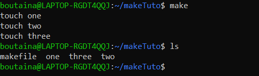

# Automatiser-la-production-de-code
 1.Running Makefile
 
  

 2.Makefile targets
 
   
   
 3.Makefile targets
 
   
   
 4.make clean
 
   
 
 5.Variables
 
   
   
 
 6.The all targets
 
   
   
   
   
 7.Multiple targets
  
   
   
   
   
 8.Multiple targets
  
   
   
   
 
 9.Automatic Variables
 
   
   
   
   
 10.Static Pattern Rules
     
   
   
   
   
 11.Command Execution
 
   
   
   
 
 12.Change Default Shell
 
   
   
   
   
 13.Recursive use of make
 
   
   
   
   
 14.Use export for recursive make
    
    
   
    
    
 
 
  
          
         
